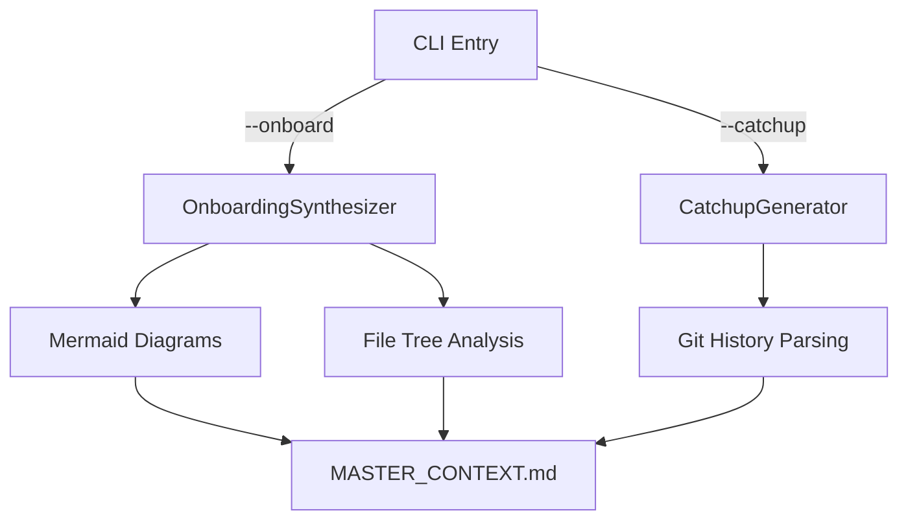
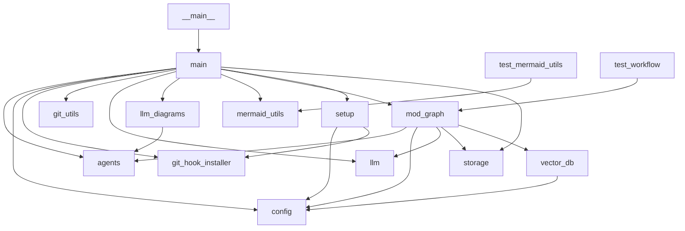

# Master Context: AI-Powered Onboarding System

## 🗺️ Architectural Overview

### Core Purpose
This repository automates the generation of **developer context**—reducing cognitive load during onboarding, context switching, or catching up after absences. It combines:
- **Structural Analysis**: File trees, dependency graphs.
- **Historical Synthesis**: Checkpoint-based change summaries.
- **Visual Aids**: Auto-generated Mermaid diagrams.

### High-Level Components


1. **CLI Layer** (`main.py`):
   - Entry point with `--onboard` (generate full context) and `--catchup` (summarize changes since a date).
   - Orchestrates workflows and validates outputs (e.g., checks for `generated_markdown` in final state).

2. **Agent Layer** (`agents.py`):
   - **Onboarding**: `MasterContextGenerator` combines file structure, checkpoints, and diagrams into `MASTER_CONTEXT.md`.
   - **Catchup**: `CatchupGenerator` filters checkpoints by date (e.g., `get_checkpoints_since`) and synthesizes summaries.

3. **Data Layer**:
   - **Git Utilities** (`git_utils.py`): Extracts author-specific history (e.g., `get_last_commit_by_author`).
   - **Storage** (`storage.py`): Manages checkpoint persistence and retrieval.
   - **Vector DB** (`vector_db.py`): *Excluded from Git*—used for semantic search during context generation.

4. **Visualization Layer** (`mermaid_utils.py`):
   - Generates dependency graphs and class hierarchies from static code analysis (AST parsing).
   - Example Outputs:
     - Dependency Graph:
       ```mermaid
       graph TD
           main --> agents
           main --> llm_diagrams
           llm_diagrams --> agents
       ```
     - Class Hierarchy:
       ```mermaid
       classDiagram
           BaseModel <|-- CheckpointConfig
           Module <|-- MasterContextGenerator
       ```

---

## 📜 Key Decision Log

| Decision                          | Rationale                                                                 | Impact                                                                 |
|-----------------------------------|---------------------------------------------------------------------------|-----------------------------------------------------------------------|
| **Auto-update `MASTER_CONTEXT.md`** | Keep documentation in sync with code changes.                          | Adds dependency on `--onboard` success in CI/CD.                     |
| **Mermaid Integration**           | Address gaps in textual descriptions for complex relationships.         | Increases onboarding time for large repos (AST parsing overhead).    |
| **Rate-Limit Retries**            | Handle LLM API instability (e.g., Gemini 429 errors).                   | Adds 35-second delay per retry; improves success rate.               |
| **Exclude `.chroma_db/` from Git** | Avoid binary bloat and merge conflicts.                                 | Requires explicit bootstrap for new environments.                     |
| **Checkpoint Naming Convention**  | Use `YYYY-MM-DD-hash.md` for sortability and uniqueness.                 | Enables date-based filtering (e.g., `get_checkpoints_since`).        |

---

## ⚠️ Gotchas & Tech Debt

### Immediate Risks
1. **Tight Coupling in Workflow**:
   - The checkpoint automation *requires* `--onboard` to succeed. If context generation fails, the entire checkpoint is aborted.
   - **Mitigation**: Decouple context generation from checkpoint commits (e.g., use a post-commit hook).

2. **Environment Assumptions**:
   - Relies on Unix tools (`tree`, `find`) for file structure generation.
   - **Workaround**: Add a fallback to Python-based directory traversal (e.g., `os.walk`).

3. **Untested Core Logic**:
   - `CatchupGenerator` and `MasterContextGenerator` lack unit tests.
   - **Priority**: Add fixture-based tests for synthesis edge cases (e.g., empty checkpoints).

### Long-Term Debt
| Item                          | Description                                                                 | Priority |
|-------------------------------|-----------------------------------------------------------------------------|----------|
| **Circular Dependencies**     | `main.py` ↔ `agents.py` ↔ `llm_diagrams.py`.                              | High     |
| **Diagram Performance**       | AST parsing may slow down for repos with 1000+ files.                     | Medium   |
| **Windows Compatibility**     | CLI tools (`tree`, `find`) may not be available.                          | Low      |
| **LLM Cost Monitoring**       | No tracking of token usage or API costs during context generation.        | Medium   |

---

## 🌐 Dependency Map

### File Dependencies


### Class Inheritance
```mermaid
classDiagram
    BaseModel <|-- CheckpointConfig
    BaseModel <|-- FeaturesConfig
    BaseModel <|-- LLMConfig
    BaseModel <|-- RepositoryConfig
    Module <|-- CatchupGenerator
    Module <|-- CheckpointGenerator
    Module <|-- LLMDiagramGenerator
    Module <|-- LegacyCheckpointGenerator
    Module <|-- MasterContextGenerator
    Signature <|-- CatchupSummarizer
    Signature <|-- ContextAnalyzer
    Signature <|-- DiagramGeneratorSignature
    Signature <|-- DiffReader
    Signature <|-- MarkdownWriter
    Signature <|-- OnboardingSynthesizer
    Signature <|-- UnifiedCheckpointSignature
    TestCase <|-- TestCheckpointWorkflow
    TestCase <|-- TestMermaidUtils
    TypedDict <|-- GraphState