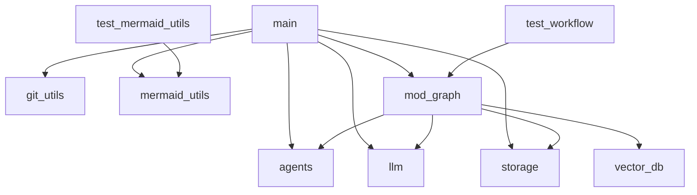
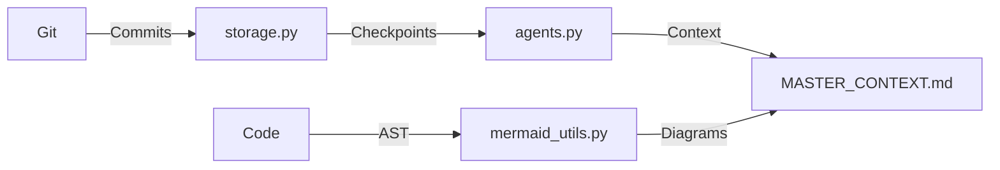

# Master Context: AI-Driven Onboarding & Catch-Up System

## Architectural Overview
### Layers
1. **CLI Interface** (`main.py`):
   - Entry point for `--onboard` (generates `MASTER_CONTEXT.md`) and `--catchup` (summarizes changes).
   - Integrates with system tools (e.g., `tree`, `git`) for context.

2. **Agent Layer** (`agents.py`):
   - **Onboarding**: `MasterContextGenerator` synthesizes repository structure and history.
   - **Catch-Up**: `CatchupSummarizer` aggregates changes by date/author.

3. **Utility Layer**:
   - `git_utils.py`: Git operations (e.g., `get_last_commit_by_author`).
   - `mermaid_utils.py`: Generates dependency/class diagrams from code.

4. **Persistence Layer**:
   - `storage.py`: Manages checkpoints and generated docs.
   - `vector_db.py`: ChromaDB for embeddings (excluded from Git).

### Workflow
1. **Onboarding**:
   ```mermaid
   graph LR
     A[main.py --onboard] --> B[get_file_tree]
     B --> C[MasterContextGenerator]
     C --> D[MASTER_CONTEXT.md]
   ```
2. **Catch-Up**:
   ```mermaid
   graph LR
     A[main.py --catchup] --> B[get_checkpoints_since]
     B --> C[CatchupSummarizer]
     C --> D[Catchup Report]
   ```

## Key Decision Log
| Decision               | Rationale                                                                 | Impact                          |
|-------------------------|---------------------------------------------------------------------------|---------------------------------|
| Auto-Generated `MASTER_CONTEXT.md` | Ensures docs stay in sync with code.                                     | Requires stable `--onboard` CLI. |
| Mermaid Diagrams        | Visualizes dependencies/class hierarchies for clarity.                  | Adds parsing complexity.        |
| ChromaDB Git Ignore     | Avoids binary bloat; enforces local setup.                                | New envs need manual DB init.   |
| Rate-Limit Retries      | Improves LLM reliability (e.g., Gemini 429 errors).                      | Adds 35s delay on failures.    |

## Gotchas & Tech Debt
1. **Critical Path**:
   - The `--onboard` command is now part of the checkpoint workflow. Failures block commits.
   - **Mitigation**: Add validation in `main.py` to skip context generation if unstable.

2. **Data Initialization**:
   - ChromaDB requires manual setup (`python -m src.vector_db --init`).
   - **Mitigation**: Add a `setup.py` script to automate DB initialization.

3. **Circular Dependencies**:
   - `mod_graph` imports `agents` and `storage`, risking tight coupling.
   - **Mitigation**: Refactor to use dependency injection.

4. **Performance**:
   - Rate-limit retries add latency. Consider async requests for parallel tasks.

## Dependency Map
### File Dependencies


### Class Hierarchy


### Data Flow
