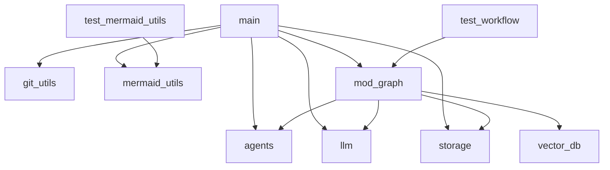
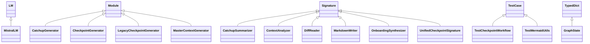
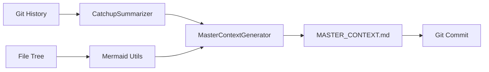

# Master Context: AI-Powered Documentation System

## Architectural Overview
### Core Components
1. **CLI Entry Point (`main.py`)**
   - Commands: `--onboard` (generates `MASTER_CONTEXT.md`), `--catchup` (summarizes changes).
   - Integrates with system tools (`tree`, `git`) and Mermaid.js for visualization.

2. **Agent Layer (`src/agents.py`)**
   - **Onboarding**: `MasterContextGenerator` + `OnboardingSynthesizer` → Creates high-level docs.
   - **Catchup**: `CatchupSummarizer` + `CatchupGenerator` → Summarizes Git history.
   - **Design Pattern**: Uses `Signature` (interfaces) and `Module` (implementations) for extensibility.

3. **LLM Integration (`src/llm.py`)**
   - Self-healing retry logic (3 attempts) for rate limits (429 errors).
   - **Tradeoff**: 35-second sleep improves success rate but adds latency.

4. **Visualization (`src/mermaid_utils.py`)**
   - Auto-generates:
     - **Dependency Graphs**: File-level imports (e.g., `main → agents`).
     - **Class Hierarchies**: Inheritance trees (e.g., `LM <|-- MistralLM`).

5. **Data Management (`src/storage.py`)**
   - **Git Integration**: Auto-commits `MASTER_CONTEXT.md` with checkpoints.
   - **Exclusions**: `.chroma_db/` ignored (requires manual bootstrap).

### Key Workflows
1. **Onboarding Flow**:
   ```mermaid
   flowchart TD
       A[main.py --onboard] --> B[get_file_tree]
       B --> C[mermaid_utils.generate_diagrams]
       C --> D[MasterContextGenerator]
       D --> E[MASTER_CONTEXT.md]
       E --> F[git add/commit]
   ```

2. **Catchup Flow**:
   ```mermaid
   flowchart TD
       A[main.py --catchup] --> B[get_checkpoints_since]
       B --> C[CatchupSummarizer]
       C --> D[CatchupGenerator]
       D --> E[CATCHUP.md]
   ```

## Key Decision Log
| Date               | Decision                          | Rationale                                                                 |
|--------------------|-----------------------------------|---------------------------------------------------------------------------|
| 2026-01-13         | Agent Layer Introduction          | Separate context synthesis from core logic for modularity.               |
| 2026-01-13         | Rate Limit Retry Logic            | Reduce manual intervention for LLM failures (tradeoff: +35s latency).    |
| 2026-02-10         | Mermaid Integration               | Visualize dependencies/hierarchies to reduce cognitive load.            |
| 2026-02-10         | Auto-Commit `MASTER_CONTEXT.md`   | Keep docs in sync with code via Git workflows.                          |
| 2026-01-13         | Remove `.chroma_db` from Git      | Avoid binary bloat; enforce explicit data initialization.               |

## Gotchas & Tech Debt
1. **Critical Path Risks**:
   - If `MasterContextGenerator` fails, the **entire checkpoint workflow halts**.
   - **Mitigation**: Add fallback to generate a minimal `MASTER_CONTEXT.md` with error details.

2. **Performance**:
   - **LLM Rate Limits**: 35-second sleep may block pipelines. Consider async retries.
   - **Mermaid Generation**: Parsing large codebases with `ast` could be slow. Cache results.

3. **Data Initialization**:
   - New environments **must run a bootstrap script** to populate `.chroma_db/`.
   - **Solution**: Add a `setup.py` to automate this step.

4. **Dependency Coupling**:
   - `mod_graph` is heavily depended upon by `agents`, `llm`, and `storage`.
   - **Refactor Target**: Split into smaller modules (e.g., `mod_graph/agents`, `mod_graph/llm`).

## Dependency Map
### File Dependencies


### Class Hierarchy


### Data Flow


## Setup Guide
1. **Prerequisites**:
   ```bash
   pip install -r requirements.txt  # Includes mermaid-cli, chromadb
   ```

2. **First-Time Setup**:
   ```bash
   python setup.py  # Initializes .chroma_db/ and validates dependencies
   ```

3. **Generate Docs**:
   ```bash
   python main.py --onboard  # Creates MASTER_CONTEXT.md
   python main.py --catchup --since 2026-01-01  # Summarizes changes
   ```

4. **View Diagrams**:
   - Render Mermaid blocks using [Mermaid Live Editor](https://mermaid.live/).