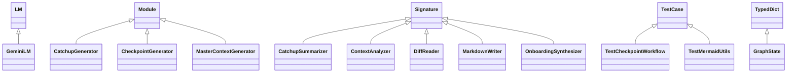

# Master Context: The Map

Welcome to the repository. This document serves as the high-level "Story" of the codebase, designed to reduce cognitive load and provide an immediate mental model of the system architecture.

## 1. Architectural Overview
This system is an **AI-Driven Context Engine**. Its primary purpose is to observe a repository's evolution and synthesize that data into human-readable (and AI-consumable) documentation.

### Core Layers:
1.  **Orchestration Layer (`main.py`, `src/graph.py`)**: Uses a graph-based state machine to manage the flow of data. It handles CLI commands like `--onboard` (to build this map) and `--catchup` (to summarize recent activity).
2.  **Agent Layer (`src/agents.py`)**: Implements specific AI roles using a "Module/Signature" pattern. Agents include `MasterContextGenerator`, `CatchupGenerator`, and `CheckpointGenerator`.
3.  **Utility Layer**:
    *   **LLM (`src/llm.py`)**: A resilient wrapper for Google's Gemini API, featuring self-healing retry logic.
    *   **Storage (`src/storage.py`)**: Manages the persistence of markdown checkpoints and the master context.
    *   **Vector DB (`src/vector_db.py`)**: Provides RAG (Retrieval-Augmented Generation) capabilities using ChromaDB.
    *   **Git Utils (`src/git_utils.py`)**: Extracts metadata and diffs from the local environment.

## 2. Key Decision Log

### Transition to Agent-Based Synthesis
*   **Decision**: Move away from linear scripts to a structured Agent/Module pattern.
*   **Reasoning**: As the complexity of "Onboarding" and "Catchup" tasks grew, hard-coded prompts became unmaintainable. The Module/Signature pattern allows for cleaner prompt engineering and task separation.

### Documentation-as-Code (Automated Master Context)
*   **Decision**: Integrate `--onboard` into the standard checkpoint workflow.
*   **Reasoning**: Ensures that the high-level architecture (`MASTER_CONTEXT.md`) never drifts from the implementation. The documentation is updated and committed automatically whenever a developer logs a checkpoint.

### Explicit Data Separation
*   **Decision**: Removal of `.chroma_db` from version control and addition to `.gitignore`.
*   **Reasoning**: Prevents repository bloat and merge conflicts caused by binary database files. This shifts the responsibility of data ingestion to the local environment setup.

### Rate Limit Resilience
*   **Decision**: Implemented a hard 35-second sleep upon encountering `RESOURCE_EXHAUSTED` (429) errors.
*   **Reasoning**: External LLM providers have strict quotas. Rather than failing the workflow, the system pauses to allow the quota window to reset, ensuring long-running documentation tasks complete successfully.

## 3. Gotchas & Tech Debt

*   **Environment Dependency**: The `get_file_tree` utility relies on system-level tools (`tree` or `find`). Ensure these are installed in your environment.
*   **Synchronous Delay**: The 35-second sleep in `GeminiLM` is synchronous. While effective for reliability, it can make the CLI appear "hung" during heavy usage.
*   **Bootstrap Requirement**: Since the vector database is no longer tracked, new contributors must run an ingestion process (if applicable) before RAG features function correctly.
*   **Naming Conventions**: The storage layer filters checkpoints based on a strict `YYYY-MM-DD` naming convention. Deviating from this will cause the `Catchup` system to miss files.

## 4. Dependency Map

### File Dependencies
```mermaid
graph TD
    graph --> agents
    graph --> llm
    graph --> storage
    graph --> vector_db
    main --> agents
    main --> git_utils
    main --> graph
    main --> llm
    main --> mermaid_utils
    main --> storage
    test_mermaid_utils --> mermaid_utils
    test_workflow --> graph
```

### Class Hierarchy
