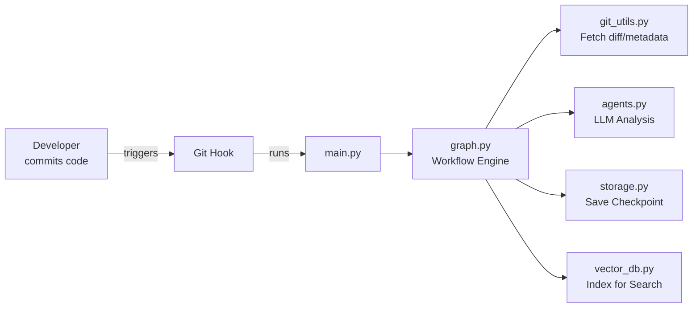

# **Code Checkpoint: Master Context**
*Your guide to the architecture, decisions, and quirks of the Code Checkpoint system.*

---

## **🗺️ Architectural Overview**
### **Purpose**
Code Checkpoint is a **developer onboarding and context recovery tool** that:
1. **Automatically generates** markdown checkpoints for code changes (via Git hooks).
2. **Uses LLMs** to analyze diffs and explain changes in plain English.
3. **Stores and indexes** checkpoints for semantic search (e.g., "Show me all changes by Alice last month").
4. **Supports any programming language** (via Git diffs + LLM abstraction).

### **High-Level Workflow**


### **Key Components**
| Component               | File(s)               | Responsibility                                                                 |
|-------------------------|-----------------------|-------------------------------------------------------------------------------|
| **CLI**                 | `main.py`             | Entry point; routes commands (`--catchup`, `--commit`).                       |
| **Workflow Engine**     | `graph.py`            | Orchestrates checkpoint generation (diff → LLM → storage → indexing).         |
| **Git Hooks**           | `git_hook_installer.py` | Installs post-commit hooks; detects dev mode to run `main.py` directly.       |
| **LLM Agents**          | `agents.py`, `llm.py` | Analyzes diffs using DSPy + LiteLLM (supports OpenAI/Mistral/etc.).            |
| **Storage**             | `storage.py`          | Manages checkpoint files; handles legacy/new filename formats.                 |
| **Vector DB**           | `vector_db.py`        | ChromaDB-based semantic search over checkpoints.                             |
| **Configuration**       | `config.py`           | Pydantic models for settings (LLM provider, paths, feature flags).             |
| **Setup Wizard**        | `setup.py`            | Interactive CLI for initial config (language detection, API keys).            |

---

## **📜 Key Decision Log**
### **1. Universal LLM Support (2026-02-17)**
- **Problem**: Original Mistral-specific implementation limited flexibility.
- **Solution**: Integrated **LiteLLM** to support OpenAI, Anthropic, Azure, Ollama, etc.
- **Tradeoffs**:
  - ✅ **Pros**: Future-proof; users can switch providers without code changes.
  - ⚠️ **Cons**: Added dependency on `litelm`; API key management complexity.
- **Files Affected**: `llm.py`, `config.py` (new `LLMProvider` enum).

### **2. Git Hook Development Mode (2026-02-17)**
- **Problem**: Hooks required global `checkpoint` installation, blocking local dev.
- **Solution**: Detect `.venv/bin/python` + `main.py` to run directly in dev mode.
- **Impact**:
  - **Backward Compatible**: Falls back to global `checkpoint` if not in dev mode.
  - **Friction Reduced**: No need to reinstall after code changes.
- **Code**:
  ```python
  # git_hook_installer.py
  if (repo_root / "main.py").exists() and (repo_root / ".venv/bin/python").exists():
      checkpoint_cmd = '.venv/bin/python main.py'
  ```

### **3. Metadata-Rich Checkpoint Filenames (2026-02-17)**
- **Problem**: Legacy format (`YYYY-MM-DD-hash.md`) lacked context (e.g., author).
- **Solution**: New format: `Checkpoint-Author-YYYY-MM-DD-hash.md`.
- **Challenge**: Regex-based parsing to support both formats:
  ```python
  # storage.py
  DATE_PATTERN = re.compile(r'(\d{4})-(\d{2})-(\d{2})')
  ```
- **Why It Matters**:
  - Enables queries like "Show all checkpoints by Alice."
  - No migration needed; old files still work.

### **4. Language-Agnostic Expansion**
- **Problem**: Originally Python-specific (e.g., hardcoded `import` parsing).
- **Solution**:
  - Use **Git diffs** (language-agnostic) as input to LLMs.
  - Added **language detection** in `setup.py` (via file extensions).
- **Example**:
  ```python
  # setup.py
  def detect_languages(repo_path):
      extensions = {f.suffix for f in repo_path.glob("**/*.*")}
      return {ext: LANGUAGE_MAP.get(ext, "unknown") for ext in extensions}
  ```

### **5. Interactive Setup Wizard**
- **Problem**: Manual config setup was error-prone.
- **Solution**: `questionary`-based CLI with validation:
  - Detects languages in the repo.
  - Validates API keys for LLM providers.
  - Writes to `.checkpoint.yaml`.
- **Example Flow**:
  ```
  ? Select your LLM provider: [OpenAI/Mistral/Azure]
  ? Enter your API key: ****
  ? Enable automatic git hooks? (Y/n)