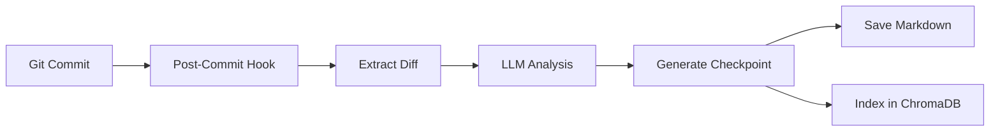

# Code Checkpoint 🚀

**Code Checkpoint** is an AI-powered developer onboarding and context recovery system that eliminates "context switching tax" for git repositories. It automatically maintains living documentation that evolves with every commit, supporting **any programming language** and **any LLM provider**.


## 🌟 Features

### 1. The Map (Master Context)
A "Master Context" document that evolves with every commit. Perfect for **New Developers**.
- **Architectural Overview**: High-level system design with Mermaid diagrams
- **Key Decision Log**: Why specific technical choices were made
- **Dependency Map**: How modules interact
- **Gotchas**: Known issues and tech debt

**Generated at**: `MASTER_CONTEXT.md` (Repo Root)

### 2. The News Feed (Personalized Catchup)
A personalized "While You Were Gone" summary for **Returning Developers**.
- **Personalized Delta**: Scans git history to find when you last contributed
- **Summarized Changes**: Exactly what changed since *you* left
- **Current Focus**: What the team is working on right now

**Generated at**: `checkpoints/Checkpoint_<YourName>.md`

### 3. Automatic Checkpoints
Post-commit git hook generates context automatically after every commit.
- **Background Processing**: Doesn't block your workflow
- **Semantic Search**: ChromaDB-powered history indexing
- **Composable Hooks**: Works alongside existing git hooks

## 🚀 Quick Start

### Installation

```bash
# Install the package
pip install -e .

# Navigate to your git repository
cd /path/to/your/repo

# Run the interactive setup wizard
checkpoint --init
```

The wizard will guide you through:
- ✨ LLM provider selection (OpenAI, Anthropic, Mistral, Ollama, etc.)
- 📁 Repository configuration
- ⚙️  Feature toggles (git hooks, diagrams, vector search)
- 🌐 Automatic language detection

### First Run

```bash
# Generate master context (onboarding document)
checkpoint --onboard

# Generate your personal catchup summary
checkpoint --catchup

# Make a commit - checkpoints auto-generate if hook enabled!
git commit -m "your changes"
```

## 📖 Usage

### Core Commands

```bash
# Setup & Configuration
checkpoint --init              # Run interactive setup wizard
checkpoint --config            # Show current configuration
checkpoint --install-hook      # Install git post-commit hook
checkpoint --uninstall         # Remove git hook

# Documentation Generation
checkpoint --onboard           # Generate Master Context for new developers
checkpoint --catchup           # Generate your personal catchup summary
checkpoint --catchup-all       # Generate catchups for all active developers

# Manual Analysis
checkpoint --commit <hash>     # Analyze a specific commit
checkpoint --commit <hash> --dry-run  # Preview without saving
```

### Configuration

Configuration is stored in `.checkpoint.yaml`:

```yaml
llm:
  provider: openai              # openai, anthropic, mistral, ollama, etc.
  model: gpt-4                  # Model name
  temperature: 0.7              # Generation temperature (0.0-2.0)
  max_tokens: 2000              # Max tokens per request

repository:
  output_dir: ./checkpoints     # Where to save checkpoints
  master_context_file: MASTER_CONTEXT.md
  vector_db_path: .chroma_db    # ChromaDB storage
  ignore_patterns:
    - node_modules
    - venv
    - .git
    - build
  file_patterns:
    - "**/*.py"
    - "**/*.js"
    - "**/*.ts"

features:
  git_hook: true                # Auto-generate on commit
  vector_db: true               # Enable semantic search
  diagrams: true                # Generate Mermaid diagrams
  auto_catchup: false           # Auto-catchup after commits

languages:
  - python
  - javascript
```

API keys are stored separately in `.env`:
```env
OPENAI_API_KEY=sk-...
# or ANTHROPIC_API_KEY, MISTRAL_API_KEY, etc.
```

## 🎯 Use Cases

### For New Developers
```bash
checkpoint --onboard
# Read MASTER_CONTEXT.md - complete architecture overview
```

### For Returning Developers  
```bash
checkpoint --catchup
# Personalized summary of changes since your last commit
```

### For Team Leads
```bash
checkpoint --catchup-all
# Generate catchup summaries for entire team
```

### In CI/CD Pipelines
```yaml
# .github/workflows/checkpoint.yml
on: [push]
jobs:
  checkpoint:
    runs-on: ubuntu-latest
    steps:
      - uses: actions/checkout@v3
      - run: pip install checkpoint-agent
      - run: checkpoint --onboard
      - run: checkpoint --catchup-all
```


## 🏗️ Architecture

### Components

- **`main.py`**: CLI entry point with command routing
- **`src/agents.py`**: DSPy agents (CheckpointGenerator, MasterContextGenerator, CatchupGenerator)
- **`src/graph.py`**: LangGraph state machine for commit processing
- **`src/llm.py`**: LiteLLM integration for universal LLM support
- **`src/config.py`**: Configuration management system
- **`src/setup.py`**: Interactive setup wizard
- **`src/git_hook_installer.py`**: Git hook installation/management
- **`src/git_utils.py`**: Git repository interactions
- **`src/storage.py`**: Checkpoint file persistence
- **`src/vector_db.py`**: ChromaDB semantic search
- **`src/mermaid_utils.py`**: Diagram generation helpers

### Workflow



## 🌐 Multi-Language Support

Code Checkpoint uses LLM intelligence to understand any programming language:
- **Python, JavaScript, TypeScript**: Full support
- **Java, Go, Rust, C++, Ruby**: Full support
- **Any language**: Works via LLM semantic understanding

Diagrams are generated using LLM analysis rather than language-specific AST parsing, ensuring universal compatibility.

## 🔧 Advanced Configuration

### Using Local LLMs (Ollama)

```bash
checkpoint --init
# Select: Ollama (Local)
# Model: ollama/llama3
# No API key needed!
```

### Custom Configuration File

```bash
checkpoint --config-file /path/to/custom-config.yaml --onboard
```

### Corporate Proxies

SSL verification is disabled by default for compatibility with corporate proxies (Zscaler, etc.). For production, configure proper certificates in `src/llm.py`.

## 🐛 Troubleshooting

### "API key not found"
```bash
# Check your .env file
cat .env
# Should contain: OPENAI_API_KEY=sk-... (or appropriate key)

# Or re-run setup
checkpoint --init
```

### "Not a git repository"
```bash
# Initialize git first
git init
git add .
git commit -m "Initial commit"
```

### Git hook not triggering
```bash
# Check hook status
checkpoint --config

# Reinstall hook
checkpoint --install-hook

# Verify executable (Unix/Mac)
ls -l .git/hooks/post-commit
```

### LLM rate limits
Rate limiting is handled automatically with exponential backoff. For high-volume usage, consider:
- Using local models (Ollama)
- Adjusting `temperature` in config
- Disabling `auto_catchup` feature

## 📦 Development

### Local Installation (Development Mode)

```bash
git clone <repo-url>
cd Checkpoint
pip install -e .
```

### Running Tests

```bash
pytest tests/
```

### Package Structure

```
Checkpoint/
├── pyproject.toml          # Package metadata
├── requirements.txt        # Dependencies
├── main.py                 # CLI entry point
├── src/
│   ├── agents.py           # DSPy agents
│   ├── graph.py            # LangGraph workflow
│   ├── llm.py              # LiteLLM integration
│   ├── config.py           # Configuration system
│   ├── setup.py            # Setup wizard
│   ├── git_hook_installer.py  # Hook management
│   ├── git_utils.py        # Git operations
│   ├── storage.py          # File I/O
│   ├── vector_db.py        # ChromaDB
│   └── mermaid_utils.py    # Diagrams
├── tests/                  # Test suite
├── checkpoints/            # Generated checkpoints (gitignored)
└── MASTER_CONTEXT.md       # Generated master context
```

## 🤝 Contributing

Contributions welcome! Areas of interest:
- Additional LLM provider integrations
- Enhanced diagram generation
- Multi-repo support
- Web UI

## 📄 License

MIT License - see LICENSE file for details

## 🙏 Acknowledgments

Built with:
- [DSPy](https://github.com/stanfordnlp/dspy) - Agent framework
- [LangGraph](https://github.com/langchain-ai/langgraph) - Workflow orchestration  
- [LiteLLM](https://github.com/BerriAI/litellm) - Universal LLM interface
- [ChromaDB](https://www.trychroma.com/) - Vector database
- [Questionary](https://github.com/tmbo/questionary) - Interactive CLI

---

**Made with ❤️ for developers tired of context switching**
